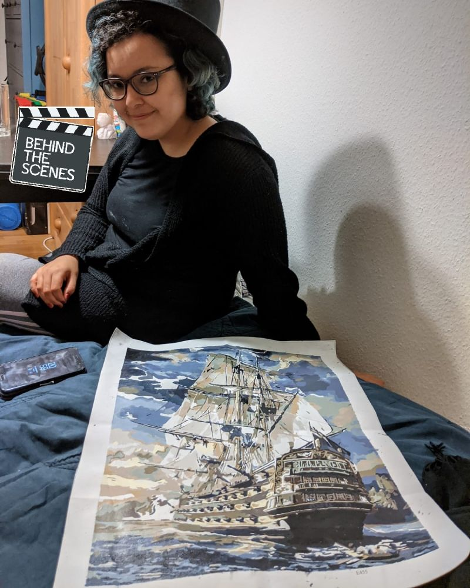
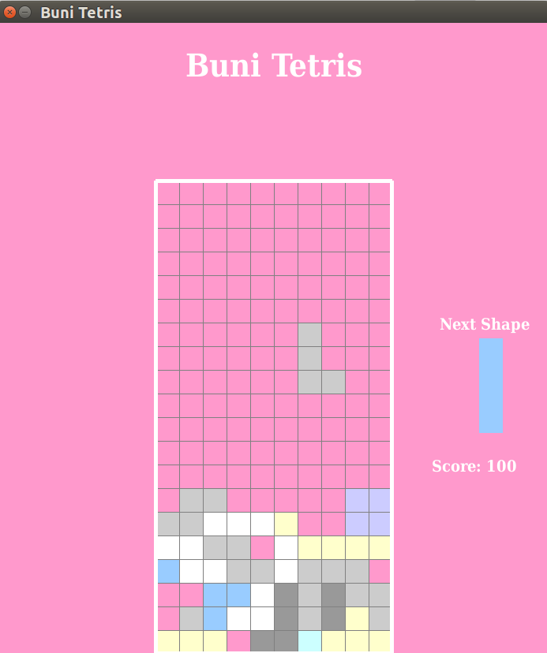
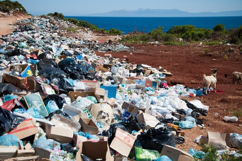
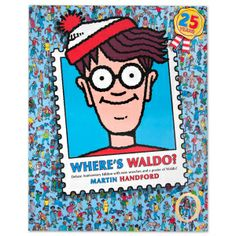

# Portfolio

Hello there, I am [Rosana de Oliveira Gomes](https://www.linkedin.com/in/rosanaogomes/), a PhD in Astrophysics and Data scientist trying to change the world one day at a time. I have experience being a Lead Machine Learning Engineer and Project Manager in multiple projects related to social impact such as disaster management, renewable energies, sustainability and mobility. 

In my free time, I love spending time in more relaxing activities, such as [painting by number](https://www.liveabout.com/painting-by-numbers-2578775) or puzzles (part of my creative process).
                                 

I am passionate about `AI for good` and am currently dedicating my career to technology for social impact, as a Senior Data Scientist in the energy sector. I have worked in the past also as a machine learning engineer, product owner and project manager together with NGOs in the humanitarian sector and impact startups. 

I am one of the founders and team leaders of the **AI Wonder Girls** team, which together with have collaborated to award winner open source projects: 

1. **AI for Healthcare Hackathon** [(repository)](https://github.com/rogomes/AI-healthcare-hackathon) [(page)](https://devpost.com/software/track-1-challenge-5-medical-imaging-communication-tools) 🏆AI Applied To Medical Imaging - Track Winner + 🏆NVIDIA Prize 

1. **MLOps for Good Hackathon** [(repository)](https://github.com/elateifsara/aiwondergirls-icu-ops) [(page)](https://devpost.com/software/child-safety) 🏆1st Prize Winner

1. **SAAI Factory - Art & AI Hackathon** [(repository)](https://github.com/rogomes/AIWonderGirls-ATHENA-Art-Assistant) [(page)](https://devpost.com/software/athena-art-assistant) 🏆Especial Prize + exhibition of the work

1. **Alibaba Climate Change Hackathon** [(repository)](https://github.com/rogomes/AIWonderGirls-Climate-Change-Mitigation-Assistant)

1. **AWS Disaster Response Hackathon** [(repository)](https://github.com/aiwondergirls/aws-disaster-response) [(page)](https://devpost.com/software/ai-wonder-girls-disaster-response) 🏆Honorable Mention Prize

1. **AWS Deep Learning Hackathon** [(repository)](https://github.com/aiwondergirls/aws-deep-learning) [(page)](https://devpost.com/software/ai-wonder-girls)

Find below some of my other side projects, selected for this repository:

1. [**Tetris Game:**](https://github.com/rogomes/portfolio/blob/master/tetris/tetris-pygame.ipynb) an implementation of Tetris using `pygame` created during the [*Build 2.0* workshop](https://thegirlcode.co/build/) hosted by *The Girl Code*.\
   *keywords:*  Python, Pygame\
                                 

2. [**Monty Hall problem:**](https://github.com/rogomes/portfolio/blob/master/monty_hall/MontyHall.ipynb) study and simulation of the *Monty Hall problem* using Python.\
   *keywords:* Statistics, Probability, Monte Carlo simulation.   
                                  

3. [**World Bank indicators:**](https://github.com/rogomes/portfolio/blob/master/wbi_waste/WBI-TrashOut-Analysis.ipynb) analysis of the [*World Bank indicators*](https://data.worldbank.org/) relevant for illegal dumping.\
   *keywords:* Pandas, Unsupervised Learning, Clustering, Principle Component Analysis (PCA), Data Analysis, Geopandas.    
                                  

4. [**NYC Community Service:**](https://github.com/rogomes/portfolio/blob/master/nyc_service/nyc_service.ipynb) analysis of the [*NYC Community Service*](https://data.world/city-of-ny/bquu-z2ht) descriptions and associated category keywords.\
   *keywords:* Natural Language Processing, Ngrams, Wordclouds, Data Analysis.    
                                  

<!--
5. **Disaster Response for Cyclones:** data analysis and modeling of the population affected by cyclones with Machine Learning techniques.\
   *keywords:* Python, Data Analysis, Random Forrest, Support Vector Machines, XGBoosting, Ensemble Models, Neural Networks, TensorFlow.

6. **Finding Waldo:** application of *image recognition* with Neural Networks to the game [*Where's Waldo*](https://en.wikipedia.org/wiki/Where%27s_Wally%3F).\
   *keywords:* Python, Neural Networks, Image Recognition, TensorFlow, Keras.\
   

   ()
7. **Energy Demand Forecasting:** predicting energy demand for renewable energies using Deep Learning. Project developed during the [*Deep Learning Datathon 2020*](https://ai4impact.org/dld.html) hosted by [*AI4Impact*](https://ai4impact.org/index.html). \
   *keywords:* Time Series, Neural Networks, Deep Learning, TensorFlow, Keras.   
   comment -->

## List of Talks (recordings in the links): ##

1. Data Natives 2022: Panel Discussion - Universities at the Forefront of Innovation and Technology (August 2022)

1. Data Natives 2022: The Power of Time Series for Renewable Energies (August 2022) 

1. [Omdena: 3 Real-World Data Projects - Detecting Forest Fires](https://www.youtube.com/watch?v=BhIuZXPM_LE) (August 2022)

1. ValleyML Conference: AI & Sustainability - Renewable Energies (August 2022)

1. [SAAI Factory Expo Malta - Panel Discussion: AI & Art](https://www.youtube.com/watch?v=F4CJyS3ZBoc) (May 2022)

1. GoodTechFest 2022: Meet the AI Wonder Girls (May 2022)

1. [AI4Diversity Conference: GAIA - Green Awareness Intelligent Assistant](https://www.linkedin.com/video/event/urn:li:ugcPost:6927957615352184832/) (May 2022)

1. World Data League - Ask me Anything: AI, Data Science and Social Impact (April 2022)

1. [Global Shapers Panel Discussion: Como conduzir o desenvimento de IA no Brasil?](https://www.youtube.com/watch?v=pzOoaHtNwJo&t=9s) (April 2022)

1. [Defined.ai: Queen of Tech Interview - International Women's Day](https://www.youtube.com/watch?v=_wDGNeC5iWQ) (March 2022) 

1. Panel Discussion: International Day of Women & Girls in Science (Prince Sultan University) (February 2022)

1. [WiDS PSU 2022 Workshop: AI & ML Applications](https://www.youtube.com/watch?v=bK76xop2FAE) (January 2022)

1. Institute of Science & Technology UK (IST): An AI Assistant for Climate Change Mitigation (January 2022)

1. [WIDS PSU 2022 Workshop: Intro to Energy Consumption and the Climate Crisis](https://www.youtube.com/watch?v=nEMv9fymQfo) (January 2022)

1. [Omdena Series: The Great Job Resignation](https://omdena.com/blog/why-data-scientists-leave-their-jobs/) (December 2021)

1. Women Who Code: Ace Hackathon with the AI Wonder girls (November 2021)

1. [PyData Hamburg: Athena Art Assistant - Women & AI Creations](https://www.youtube.com/watch?v=bk8NhYsb4l4) (November 2021)

1. [Meninas na Ciência: Partiu UFRGS Especial Carreiras](https://youtu.be/mHwUahwtjds) (October 2021)

1. PyData Global: Becoming a Tech Conference Speaker (October 2021)

1. Moinworld: Meet the AI Wonder Girls (October 2021)

1. Super Data Science Career Chats: Colearn students meeting (September 2021)

1. Kent State University (KSU) Colloquium: AI for Social Impact (September 2021)

1. Omdena Saudi Arabia Chapter: Introducing Omdena (September 2021)

1. [UFRGS Colloquium: Time Series - from Astronomy to Social Impact](https://www.youtube.com/watch?v=HUXZTzBeSwE&t=450s) (September 2021)

1. Women in MKAI Panel Discussion (August 2021)

1. [AI4: A Recommender System for Volunteering Work](https://www.youtube.com/watch?v=igvdJJ-l2pA) (August 2021)

1. [Omdena Women: Meet the AI Wonder Girls](https://www.youtube.com/watch?v=ZX_aDLQLSyg) (July 2021)

1. [ICML 2021 Workshop: Tackling Climate Change with Machine Learning Panel Discussion](https://slideslive.com/38964340/tackling-climate-change-with-machine-learning) **(Panel Discussion at 2:05:25 / July 2021)**

1. Omdena Nigeria Chapter: AI & Renewable Energies (July 2021)

1. [WomenTech Global Conference: AI & Society: How can technology make the world a better place?](https://www.womentech.net/speaker/Rosana%20/de%20Oliveira%20Gomes/52754#.YLq-lvYO07E.linkedin) (June 2021)

1. [Omdena Career: How to Stand out in the Data Science Job Market](https://www.youtube.com/watch?v=mk81EubDhIs) (May 2021)

1. UNAM( Universidad Nacional Autonoma de Mexico)- AI Adventures: Becoming a Data Scientist (May 2021)

1. Women Who Code Data Science: Instagram Live Interview (April 2021)

1. [Data Science Go Virtual Conference: The Beautiful world of AI for Good](https://www.youtube.com/watch?v=dSYxPKPjXtg) (April 2021)

1. [MKAI Panel: AI for Smart Energy Management](https://youtu.be/s5f_4AjprNI) (March 2021)

1. [Development Student Clubs University of British Columbia: AI for Good](https://youtu.be/Z_I6FTkcdPM) (March 2021)

1. [Pie & AI São Paulo: Inteligência Artificial para um mundo mais verde](https://youtu.be/qKYcA7jjS-w) (March 2021)

1. [Women in Data Science Conference (WiDS 2021): A Recommender System for Nature-Based Solutions (registration requested](https://10times.com/e1s4-12k9-hxzd/live?id=514920) (March 2021)

1. [Thought Leadership Webcast: AI for Good](https://www.youtube.com/watch?app=desktop&v=DxObOdnlSow) (February 2021)

1. Data Science Waiting Room: Being a Woman in STEM (February 2021)

1. [AI+ Career Lab 2021: Transitioning into a Career in Data Science (Records on Demand)](https://app.aiplus.training/courses/ai-career-lab-2021-on-demand-recordings) (February 2021)

1. [Favored Online: How to Channel your Career to Data Science](https://youtu.be/_oYkgu4oZm4) (January 2021)

1. [Teachers for Future: AI, Climate Change and Education](https://teachers4f.de/SchulStrategie/) (January 2021)

1. Data Science Waiting Room: Getting into Data Science (December 2020)

1. [AI Meetup Berlin:Fighting the Climate Crisis with AI](https://drive.google.com/file/d/14uCwZRZONup_wKCOuap6nPXvlhMz3CDZ/view) (December 2020)

1. IEEE Arab IoT and AI Challenge 2020 - AI for Social Impact: technology for the good of society (November 2020)

1. [Data Natives Conference 2020: Deepfakes Panel Discussion](https://www.youtube.com/watch?v=rdDNgwwcpL4&feature=youtu.be) (**time: 3:13:05-3:52:26 / November 2020)

1. [Women Techmakers Casablanca: Inspiring Women Panel](https://m.facebook.com/story.php?story_fbid=3457191281024664&id=100002014779985) (November 2020)

1. [Data Natives Unlimited: NLP Panel Discussion](https://youtu.be/xyf-0I_NiRE) (October 2020)

1. [RE-WORK Women in AI Podcast - What is AI for Social Good?](https://m.youtube.com/watch?feature=youtu.be&v=s_uQvYzfMh8) (September 2020)

1. [Omdena Demo Day: Building an AI Unabled NGO](https://omdena.com/blog/ai-ngo/) (September 2020)

1. [Conference talk on Astrophysics: The Physics of Twin Stars](https://youtu.be/FrZHAkR036k) (September 2020)

1. [RE-WORK: AI for Crisis Prediction and Management.](https://www.youtube.com/watch?v=L0Ceu-WRbIU) (June 2020)

1. [Omdena Demo Day: Artificial Intelligence for Disaster Response](https://www.youtube.com/watch?v=ZX2kH219Rx8) (May 2020)

1. [Omdena Webinar: Imposter Syndrome in Data Science](https://omdena.com/blog/impostor-syndrome-data-science/) (April 2020)

## Publications: ##

* Check [my Google Scholar](https://scholar.google.de/citations?user=zlXNBA0AAAAJ&hl=en) for publications in Astrophysics (Neutron Stars research)

* [The effect of inhomogeneous carbon prices on the cost-optimal design of a simplified European power system](https://ieeexplore.ieee.org/abstract/document/9105371) *Published at IEEE*

* [AI for disaster response: Predicting relief during cyclones](https://www.crisis-response.com/comment/blogpost.php?post=574) - *Published in the Crisis Response Blog*

* [AI meets Art: can creativity be replicated?](https://rosana-gomes-phd.medium.com/ai-meets-art-can-creativity-be-replicated-430ec1e5ef80) - *Published in the Omdena Blog*

* [Understanding Nature-Based Solutions through Natural Language Processing and Machine Learning](https://medium.com/omdena/understanding-nature-based-solutions-through-natural-language-processing-and-machine-learning-fdb79d416f02) - *Published in the Omdena Blog*

* [Switching into Data Science](https://www.datacamp.com/community/blog/switching-into-data-science) - *Published at DataCamp*

* [Successfully Transitioning Into a Data Science Job in the Energy Sector](https://medium.com/omdena/successfully-transitioning-into-a-data-science-job-in-the-energy-sector-72b705faaacd) - *Published in the Omdena Blog*

* [Wind Energy Trade with Deep Learning — Time Series Forecasting](https://towardsdatascience.com/wind-energy-trade-with-deep-learning-time-series-forecasting-580bd41f163) - *Published in Towards Data Science*

* [Accelerating the Clean Energy Transition](https://omdena.com/blog/clean-energy/) - *Published in the Omdena Blog*

* [The Trash We Make: Applying Machine Learning for Analyzing and Predicting Illegal Dumpsites](https://medium.com/omdena/the-trash-we-make-applying-machine-learning-for-analyzing-and-predicting-illegal-dumpsites-7aa0349989ad
) - *Published in the Omdena Blog*

* [COVID-19 Policies: Where the Wealthy Become Poor & the Poor Become Poorer](https://medium.com/omdena/covid-19-policies-where-the-wealthy-become-poor-the-poor-become-poorer-757cad41458c?source=social.linkedin&_nonce=ZgY89gmU&_branch_match_id=494647957556010682) - *Published in the Omdena Blog*

## Recommendation of the Week Series ##
if you are interested in AI for social good and career change, follow my [series of weekly recommendations on LinkedIn](https://www.linkedin.com/feed/update/urn:li:activity:6717864888108097536/).

Topics covered so far: 

🤓 [Intro resources to get into AI](https://www.linkedin.com/posts/rosanaogomes_introduction-to-machine-learning-youtube-activity-6701210695649775619-3R_R?lipi=urn%3Ali%3Apage%3Ad_flagship3_detail_base%3B43qmOhdKQ5mj4jGB0eRC4Q%3D%3D)     
🗂️ [Datasets for Social Good](https://lnkd.in/dV42tB7)     
📝 [Documentation and Open Source projects](https://www.linkedin.com/posts/rosanaogomes_the-beginners-guide-to-contributing-to-open-activity-6703712612179312640-ZVl5?lipi=urn%3Ali%3Apage%3Ad_flagship3_detail_base%3B43qmOhdKQ5mj4jGB0eRC4Q%3D%3D)     
📊 [Storytelling and Visualizations](https://lnkd.in/deiVzQK)   
🤖 [Computer Vision and Annotations](https://lnkd.in/dnqUJCG)     
💻 [Technical interviews](https://lnkd.in/dSdVEVd)     
🗣 [AI for Good former Conferences](https://www.linkedin.com/feed/update/urn:li:activity:6718968178657005568/?lipi=urn%3Ali%3Apage%3Ad_flagship3_detail_base%3B43qmOhdKQ5mj4jGB0eRC4Q%3D%3D)           
🌏 [AI for Renewable Energies](https://lnkd.in/diVSdV2)     
⚖️ [AI for Ethics](https://www.linkedin.com/posts/rosanaogomes_home-ai-for-peace-activity-6696121980258668544-nSdE?lipi=urn%3Ali%3Apage%3Ad_flagship3_detail_base%3B43qmOhdKQ5mj4jGB0eRC4Q%3D%3D)     
🗺 [Geospatial Analysys](https://www.linkedin.com/posts/rosanaogomes_gis-lounge-gis-lounge-activity-6726545296194600961-lG8X?lipi=urn%3Ali%3Apage%3Ad_flagship3_detail_base%3B43qmOhdKQ5mj4jGB0eRC4Q%3D%3D)     
🔭 [Astronomy](https://lnkd.in/dQTce7f)      
⚛ [AI and Physics](https://www.linkedin.com/posts/rosanaogomes_ai-for-physics-physics-for-ai-activity-6736669418027278337-KWrl?lipi=urn%3Ali%3Apage%3Ad_flagship3_detail_base%3B43qmOhdKQ5mj4jGB0eRC4Q%3D%3D)              
🎓 [Research tools](https://www.linkedin.com/feed/update/urn:li:activity:6721504525410168832?lipi=urn%3Ali%3Apage%3Ad_flagship3_detail_base%3B43qmOhdKQ5mj4jGB0eRC4Q%3D%3D)              
🤖 [Intro to Computer Vision](https://www.linkedin.com/posts/rosanaogomes_machine-learning-for-roof-detection-and-solar-activity-6731578752981061632-mvgd?lipi=urn%3Ali%3Apage%3Ad_flagship3_detail_base%3B43qmOhdKQ5mj4jGB0eRC4Q%3D%3D)                                                                       🌐 [NeurIPS Conferences](https://www.linkedin.com/posts/rosanaogomes_pie-ai-nairobi-neurips-2020-meetup-activity-6741686401756078080-fHyS)   
⚕ [AI for Healthcare](https://www.linkedin.com/posts/rosanaogomes_sds-216-data-science-in-healthcare-podcast-activity-6751936297046171649-btHt)  
⌛ [Time Management](https://www.linkedin.com/feed/update/urn:li:activity:6754293929933328384/)    
🔨 [Hands-on Opportunities](https://www.linkedin.com/feed/update/urn:li:activity:6764587904841867264/)  
🎨 [ AI and Art](https://www.linkedin.com/feed/update/urn:li:activity:6757292819506855936/)  
♀️ [Women and AI](https://www.linkedin.com/posts/rosanaogomes_women-who-code-home-activity-6775499880631701504-rPr6)  
🌳 [AI and Sustainability](https://www.linkedin.com/posts/rosanaogomes_women-who-code-home-activity-6775499880631701504-rPr6)  
📰 [Natural Language Processing](https://www.linkedin.com/posts/rosanaogomes_nlp-ai-impact-activity-6780883194351783936-hWas)  
🔎 [Bias in AI](https://www.linkedin.com/posts/rosanaogomes_coded-bias-netflix-activity-6785081795525271552-dA0a)  
🌊 [AI for Disaster Management](https://www.linkedin.com/posts/rosanaogomes_ai-for-disaster-response-predicting-relief-activity-6789824887239262208-JnOC)  
💼 [AI in HR](https://www.linkedin.com/feed/update/urn:li:activity:6799913466229485568/)  
⚙ [MLOps](https://www.linkedin.com/posts/rosanaogomes_mlops-ai-summit-activity-6805591215120121856-_TfS)  

## Contact ## 
 rosana.gomes.phd@gmail.com     [rosanaogomes](https://www.linkedin.com/in/rosanaogomes/)

 [@rosana.gomes.phd](https://medium.com/@rosana.gomes.phd)      [rogomes](https://github.com/rogomes)

## Licenses ##

`34003.jpg`: Wikipedia (Public Domain)  

`illegaldump.jpeg` : Photo by Antoine GIRET on [Unsplash](https://unsplash.com/)

`community.jpg` : Photo by Elaine Casap on [Unsplash](https://unsplash.com/)

